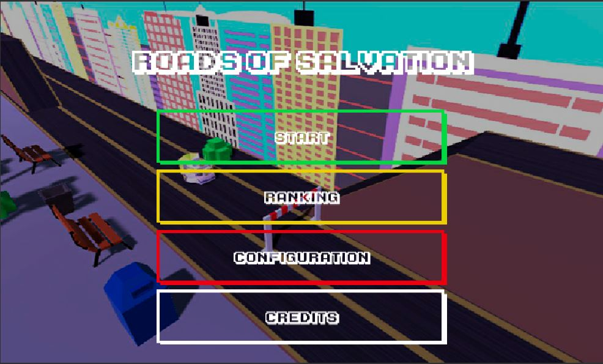
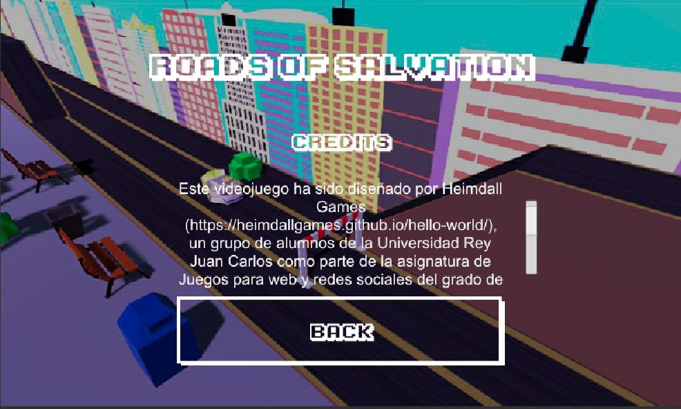
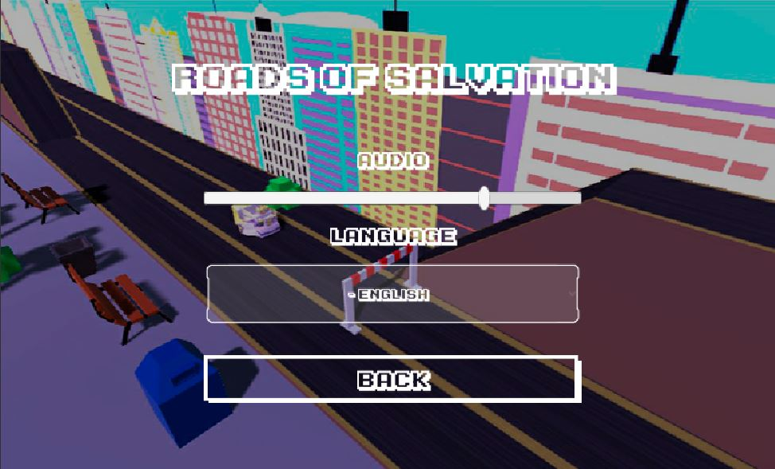
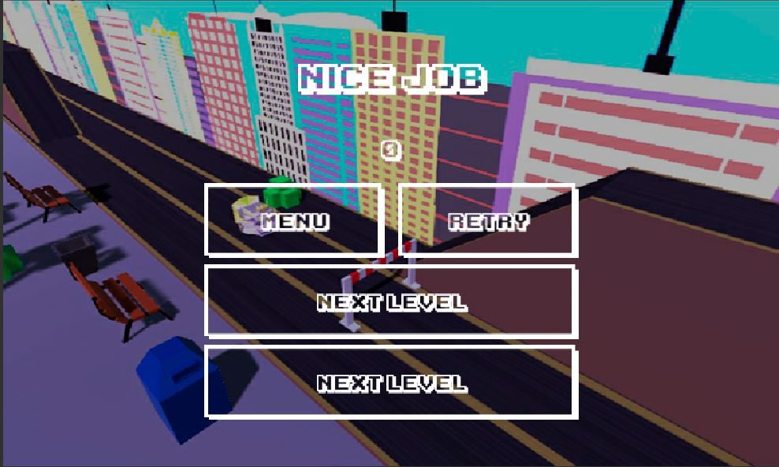

# Roads of Salvation - GDD
## Introducción

Este  es  el  documento  de  diseño  del  videojuego “*Roads  Of  Salvation*”, diseñado  para  navegadores  web  en  dispositivos  móviles,  ordenadores  y tablets.  El  juego  se  desarrollará  con  *Unity*,  usando  herramientas  externas como *Blender*, *SketchUp* y *3Ds Max*. En este documento se detallarán todos los conceptos clave relacionados con el juego, como las mecánicas, el arte, los personajes, los escenarios y toda la jugabilidad

## Concepto del juego
*Roads Of Salvation* es un videojuego 3D de conducciónen el que el jugador podrá elegir entre diferentes caminos, cambiando así las mecánicas del juego y los objetivos. En una primera versión del juego existirán dos caminos: el de Dios y el de Satán. Si se elige el camino de Dios, el jugador se montará en su vehículo y deberá esquivar señoras mayores e ir cogiendo botes de agua  bendita  y  biblias.  Si  por  el  contrario  se  elige el  camino  de  Satán,  el jugador se montará para atropellar a todas las viejas que vea y coger los pentáculos y símbolos satánicos que encuentre. Este  videojuego  es  una  mezcla  de  un  juego  de  conducción  de scroll lateral en 3D con plataformas y elementos arcade.

## Características distintivas
* Dos  formas  de  jugar:  elige  tu  propio  camino  y las  mecánicas cambiarán.
* Un juego que mezcla elementos arcade, juegos de conducción y plataformas.
* Videojuego  en  3D  donde  podemos  cambiar  de  carril  para esquivar, atropellar o conseguir objetos.
* Temática cómica y estética cartoon con elementos religiosos.

## Género
*Roads Of Salvation* nace de juegos como *Excitebike*, *Uphill* *Rush*, *Zombie Squado*, *Little  Big  Planet* mezclándolo  todo  con  elementos  de  comedia, parodias  religiosas  y  con  la  opción  de  dejarle  al  jugador  elegir  el  tipo  de juego que quiere. Los géneros en los que se basa son:
* **Deportivo**: en  el  juego  manejas  un  vehículo  a  través  de  diferentes escenarios con temáticas distintasy obstáculos.
* **Arcade**: hay   diferentes   niveles   de   dificultad,   con   un   nivel introductorio que actúa como tutorial. Después, eljugador podrá elegir el camino que desea.
* **Plataformas**: los distintos escenarios obligarán al jugador a moverse entre los diferentes carriles por donde circula el vehículo para superar los desafíos.
  
## Propósito y Público Objetivo
Este juego está orientado a un público más  maduro, con una edad mínima recomendable  de  16  años, pues  incluye  elementos  de  sátira  religiosa  que pueden ofender sensibilidades o no ser entendidos por un público infantil.

El PEGI de este juego sería de mayores de 16 años.
 
 ## Alcance
 El objetivo de este proyecto es presentar un juego divertido, sencillo y que plantee  la  posibilidad  de  elegir varios caminos  distintos,  donde  el  jugador tendrá diversas formas de jugar para duplicar la experiencia. En un primer momento se incluirá la opción de elegir entre dos caminos y posteriormente se aumentará la experiencia de juego incluyendo caminos alternativos.

 ## Mecánicas de juego
 En este apartado se explicará de forma detalla las mecánicas de juego que determinan  a Roads  Of  Salvation. Se  hablará,  de  los  niveles  del  juego,  la jugabilidad,  los  diferentes  objetivos  de  cada  partida,  la  forma  de  jugar  y cómo conseguir puntos.
 ## Jugabilidad
 El juego se dividirá en 5 escenarios distintos. El primer nivel actuará como tutorial para enseñar aljugador las mecánicas básicas del juego. Cuando se acabe este primer nivel, el usuario deberá elegir el camino del mal o del bien.
 * **Movilidad**: el personaje recorreun circuito donde podrá cambiar de carril  según  la  necesidad  del  momento  y  aumentar  y  disminuir  la velocidad.
 * **Obstáculos**   y   objetos: habrá   diferentes   señoras   mayores   que deberemos esquivar o atropellar, además de diferentes objetos detemática religiosa, como Biblias, pentáculos, botellas de agua bendita, cruces invertidas y demás.
## Movimientos
Al tratarse de un juego tipo scroll lateral en tres dimensiones, es necesario mencionar que la cámara estará en una posición de unos -60º respecto al eje horizontal  del  escenario  y  30º  respecto al  eje  vertical,  para  dotar  a  esta  de profundidada  la  vez  que  mantiene  la  esencia  básica  de  los  juegos  de  este tipo.

Por otro lado, el personaje podrá realizar diferentes movimientos a lo largo de la partida.

* El  avatar  estará  continuamente  moviéndose  hacia  la  derecha  de  la pantalla (en línea recta) pero se podrá cambiar de posición entre los 3 carriles que forman cada escenario.
* A pesar de que habrá un límite mínimo  y máximo de  velocidad que pueda  alcanzar  el  personaje,  el  jugador  podrá  frenar  y  acelerar  para sortear los obstáculos.
Los  controles  están  adaptados  para  jugarse  en  navegadores,  tanto  en dispositivos  móviles  como  en  ordenadores  o  tablets.  A  continuación,  se muestran unos ejemplos de cómo serían en teclado o en pantalla: en teclado usamos las teclas WASD para acelerar/frenar y cambiar de carril y en la pantalla pulsamos unos botones a los laterales o deslizamos el dedo hacia arriba o abajo.

  
*Figura 1: ejemplo de controles en teclado.*

  
*Figura 2: ejemplo de controles en una pantalla táctil.*

## Niveles
Si el usuario ha elegido el camino de  Dios,  el jugador irá montado en una cruz e irá esquivando señoras mayores, cogiendo botellas de agua bendita y Biblias. Este camino incluye 2 niveles de dificultad distintos. Por otro lado, si el usuario ha elegido el camino de Satán, su objetivo será distinto: deberá atropellar  a  todas  las  personas  que  vea,  además  de  coger  pentáculos  y elementos satánicos.
Los  escenarios  tendrán  una  estructura  similar  en  ambos  caminos,  pero cambiará  la  estética,  los  objetos  en  pantalla,  el  asset  del  jugador  y  habrá variaciones en el terreno, como saltos distintos, zonas elevadas, etc.

## Dificultad
Como  se  ha  mencionado,  después  del  nivel  inicial  del  tutorial,  habrá  dos niveles de un camino y dos niveles de otro. En cada nivel habrá obstáculos y elementos que conseguir, pero en el último nivel de cada camino el usuario tendrá que huir de un ser que le perseguirá y le lanzará cosas. En el camino de  Dios, Darwin perseguirá  al  usuario  lanzándole libros  de  ciencia;  en  el camino  de  Satán, un  señor  será  el  perseguidor  y  lanzará  panfletos  de  la iglesia.
El jugador sólo dispone de una vida por nivel. Si se choca con un objeto o le alcanza  un  elemento  lanzado  por  los  perseguidores,  el  nivel  empezará  de nuevo.

## Puntuación
Independientemente  del  modo  de  juego  que  se  elija,  la  primera  forma  de conseguir puntuación será recoger los objetos coleccionables mencionados previamente, como las Biblias, las botellas de agua bendita o los pentáculos.

Después,  dependiendo  del  camino  que  se  elija, la  puntuación también se obtendrá o bien esquivando a las señoras mayores, si se ha elegido el camino bueno, o bien atropellándolas, si se escoge el malo.

La  puntuación  final  de  cada  nivel  se  obtiene  en  función  de  los  puntos obtenidos como se explica anteriormente y del tiempo que se tarde en superar cada nivel.

## Flujo de Juego
En este apartado se detallará con precisión una partida del juego *Roads Of Salvation*. Se explicarán las opciones de las que dispondrá el jugador en el menú principal y cómo será su recorrido en los niveles del juego.

Cuando el juego se inicie, se mostrará un menú con una estética tipo cartoon con las siguientes opciones:
1. Jugar
1. Configuración
1. Contacto y Créditos
1. Salir
1. Mejores puntuaciones

Si el jugador elige la opción de “Jugar”, se dará paso a un nivel 0 que actuará como  tutorial.  Allí,  el  jugador  aprenderá  las  mecánicas  básicas,  cómo manejar el vehículo que controla, cómo conseguir puntos o cómo superar los obstáculos. La estética de este nivel es plana, sin adornos ni sprites, sólo un circuito de color cartón y un personaje subido encima de un aerodeslizador. Si ya se ha jugado previamente el tutorial, este se podrá saltar.

Una vez finalizado el tutorial, se mostrará una pantalla donde se le dará al jugadorla opción de elegir una de las dos modalidades de juego. Si el usuario elige el camino de “Dios”, comenzará el nivel 1 de este camino. Este nivel tendrá una temática agradable y familiar donde el usuario está circulando por una ciudad. El avatar del jugador pasará a ser un joven angel con un halo en la cabeza,subido en un aerodeslizador con motivos cristianos. El terreno por el que circulará  será  similar  al  del  tutorial,  pero  con  diferentes  obstáculos.  El jugador deberá superar el nivel esquivando  a las señoras mayores a la  vez que va cogiendo objetos coleccionables para conseguir puntos extra.

Cuando se supere el segundo nivel, el usuario pasará al nivel 2, donde  las mecánicas  serán  iguales,pero  con  una  diferencia:  en  este  nivel, el  usuario deberá continuar superando obstáculos y consiguiendo objetos mientras es perseguido por un ser que le lanza objetos. En el caso del camino de Dios, será Darwin el que lance libros de ciencia al jugador mientras le persigue.

Si el jugador supera este nivel, saldrá una pantalla de victoria  y volverá al menú principal.
Si  el  jugador  ahora  elige el  camino  de  Satán,  se  cambiarán  la  estética  y levemente  las  mecánicas  respecto  al  camino  contrario.  En  este  caso,  el escenario  es  una  ciudad  en  llamas, con  un  filtro  rojizo  que  tiñe  todo  el escenario. El avatar del usuario será un niño con cuernos subido ahora en un aerodeslizador con motivos satinicos. 

El  jugador  deberá  ahora  superar  los  obstáculos  mientras  atropella  señoras mayores.

El segundo del nivel de este camino también tiene un perseguidor. En este caso será un cura que lanza panfletos de la Iglesia Católica.

Cuando el jugador haya acabado los dos niveles, habrá completado el juego entero, pero podrá volver a jugarlos las veces que quiera para conseguir una mayor puntuación en los niveles.

Las otras opciones que tiene el jugador son: “Configuración”, para cambiar el idioma y activar/desactivar el sonido; “Contacto y Créditos” para saber quién ha diseñado este increíble videojuego; “Salir” para cerrar la aplicación; o “Mejores puntuaciones” para ver qué usuario ha conseguido más puntos.

## Personajes, objetos y escenarios.
En esta sección se detallarán todos los objetos que aparecerán en una pantalla del juego. A pesar de que en el apartado de “Arte” se detallará la apariencia del  juego,  cabe  destacar  que  el  juego  tiene  como  referente  a  títulos  como *“Little Big Planet*”, “*Overcooked*” o "*Cross the Road*" en cuanto al estilo visual se refiere, por lo tanto,habrá diversas figuras geométricas con estilo cartoon y apariencia graciosa en 3 dimensiones.

### Protagonista
El  personaje  que  manejará  el  usuario  estará  representado con  3  avatares distintos:
* Durante el **tutorial**, la apariencia del personaje será de un niño estándar subido en un aerodeslizador.
* En el **camino de Dios**, el niño tendrá un halo en la cabeza y alas de angel, vestido con una tunica y con un aerodeslizador decorado con cruces cristianas.
* En el **camino de Satán**, será un niño con cuernos y una capa subido en un aerodeslizador decorado con pentagramas sátanicos.

### Señoras mayores
Son  los personajes a los que tienes que esquivar o atropellar, dependiendo del camino, en el juego. Su apariencia es de abuelita típica un poco rechoncha con un moño en la cabeza.

### Perseguidores
En el último nivel de cada camino el usuario será perseguido por un  NPC que  lanza objetos.  En  el  caso  del  camino  de  Dios,  será  Darwin  lanzando libros  de  ciencia  y  en  el  camino  de  Satán,  será  un  señor  con  traje  tirando panfletos de la Iglesia Católica.

### Objetos coleccionables.
En  todos  los  escenarios,  el  protagonista  deberá  ir  recogiendo  diferentes objetos para conseguir más puntos. Estos objetos serán: Biblias, botellas de agua bendita, halos, pentáculos, símbolos satánicos,  y discos de black metal.

### Escenarios
En el juego habrá 3 tipos de escenarios distintos. A pesar de que en general tiene una estructura parecida, difieren en la  estética, los objetos que contienenen y en algunos obstáculos.

* **Escenario  del  tutorial**:  escenario  sin  assets  ni  fondo,  con  un  color marrón  cartón.  Sirve  para  que  el  jugador  entienda  las  mecánicas básicas del juego y practique.
* **Escenario  camino  de  Dios**:  los  dos  escenarios  de  los  respectivos niveles de este camino tienen una estética agradable y están situados en una ciudad. Aquí el protagonista tiene el avatar de “niño bueno”, elfondo está compuesto por edificios, coches y árboles y los objetos coleccionables serán Biblias, halos y botellas de agua bendita.
* **Escenario  camino  de  Satán**:  en  estos  dos  niveles,  el  escenario  está compuesto  por  una  ciudad  en  llamas,  con  edificios  destruidos  y árboles  secos.  Un  filtro  rojizo  cubrirá  todo  el  mapa,  el  avatar  del personaje será el del “niño diabolico con cuernos” y los objetos que se podrán recoger serán pentáculo, símbolos satánicos y discos de black metal.

## Interacciones
En este videojuego, el usuario podrá interactuar con diferentes elementos del escenario.  A  continuación,  se  explicarán  con  detalle  cada  una  de  estas interacciones:
* **Protagonista-Señora  mayor**:  el  usuario  podrá  esquivar  o  atropellar  a cada una de estas pobres ancianas.
* **Protagonista-Objetos coleccionables**: el jugador encontrará en ambos tipos de escenarios objetos que le darán más puntos si los coge.
* **Protagonista-Escenario**: durante cada nivel, el usuario deberá esquivar obstáculos, saltar por algunas zonas, subir rampas, etc.

## Interfaz
En  esta  sección  se  especificará  con  detalle  cada  una  de  las  pantallas  que componen *Roads Of Salvation*. Además, se indicarán las transiciones entre ellas, así  como  la  utilidad  de  cada  elemento  de  la  *GUI  (Graphical  User Interface)*.

## Diagrama de flujo
Aquí  se  mostrará  el  conjunto  de pantallas  que  forman  el  videojuego  y  su transición entre ellas para, posteriormente, centrarse en cada una de ellas

  
*Figura 3: Diagrama de flujo de las pantallas de juego.*

## Pantallas
### Menú principal
A continuación, se muestra el diagrama del menú principal.

  
*Figura 4: Pantalla del menú principal.*

Lista y descripción de los componentes.
* **Jugar**: Este botón llevará al usuario al tutorial para empezar una partida desde cero.
* **Salir**: Para salir de la aplicación.
* **Botón de los engranajes**: Con este botón el usuario accederá a los  ajustes,  para  cambiar  el  idioma  y  activar/desactivar  el sonido.
* **Créditos**: Si el jugador pulsa en este botón, accederá a  la  lista  de  integrantes  del  equipo  de Heimdall  Games, junto con una pantalla de créditos y formas de contactar.
* **Ranking**: Aquí se verán las mejores puntuaciones.

### Créditos
Aquí se mostrará un boceto de la pantalla de Créditos.

  
*Figura 5: Pantalla de créditos.*

Lista y descripción de los componentes.
* **Botón flecha**: sirve para volver al menú principal.

### Mejores puntuaciones
A continuación, un boceto de la pantalla de Ranking/Mejores puntuaciones.

  
*Figura 6: Pantalla de mejores puntuaciones.*

Lista y descripción de los componentes.
* **Botón flecha**: sirve para volver al menú principal.

### Configuración
A continuación, un boceto de la pantalla de configuración.

  
*Figura 7: Pantalla de configuración.*

Lista y descripción de los componentes.
* **Checkbox**: para desactivar/activar el sonido
* **Desplegable**: lista desplegable para seleccionar el idioma.
* **Botón flecha**: sirve para volver al menú principal.

### Game Over
Aquí se muestra un prototipo de la pantalla de Game Over cuando el jugador consigue un nuevo récord.

  
*Figura 8: Pantalla de Game Over.*

Lista y descripción de los componentes.
* **Name Input**: El jugador usará este input para introducir sus iniciales.
* **Botón flecha**: Sirve para volver al menú principal.

## Nivel
En este apartado se mostrará una aproximación a lo que serán los escenarios finales del videojuego. Lo que se enseña son bocetos de una idea básica del escenario   de   juego   para   que,   posteriormente,   se   puedan   desarrollar completamente

## Arte
El  videojuego  de *Roads  Of  Salvation* tendrá  una  estética  cartoon  en  tres dimensiones, con influencias como *Pokémon Quest* o *Cross the Road*. Los personajes tendrán una apariencia    geométrica y cómica, con cuerpos exagerados y desproporcionados.

Para dotar al videojuego de una estetica comun se ha optado por usar una pateta de colores muy reducida, obtenida online, pero ligeramente modificada para añadir ciertos colores de uso reducido como el negro, gris oscuro, o piel.

  
*Figura 9: Paleta de colores.*

Para el videojuego se necesita una buena cantidad de elementos en 3D para representar  los  personajes,  los  objetos,  los  vehículos  y  los  obstáculos  del escenario. A continuación, se detallarán estos objetos:

### Personajes principales y vehículos
Se necesitan  3  avatares  para  el  personaje principal. Los vehículos seran aerodeslizadores y forman  parte  del  avatar  del  protagonista,  por  lo  tanto, también son necesarios tres diseños distintos.

  
*Figura 10: Personaje principal neutro con vehículo.*

  
*Figura 11: Personaje principal bueno con vehículo.*

  
*Figura 12: Personaje principal malo con vehículo.*

### Otros personajes
Se debe crear un avatar tanto para las viejas, como para los perseguidores de Darwin y del cura.

  
*Figura 13: Personaje esquivable: Ancianas.*

  
*Figura 14: Perseguidor bueno: Darwin.*

  
*Figura 15: Perseguidor malo: Cura.*

### Objetos
Se deben crear objetos en tres dimensiones para los objetos coleccionables del juego.

  
*Figura 16: Coleccionable bueno: halo.*

  
*Figura 17: Coleccionable bueno: biblia.*

  
*Figura 18: Coleccionable bueno: agua bendita.*

  
*Figura 19: Coleccionable malo: simbolo satanico.*

  
*Figura 20: Coleccionable malo: pentaculo.*

  
*Figura 21: Coleccionable malo: agua bendita.*

### Escenario
Se  deberán  crear diferentes elementos que actúen como decoracion del escenario, así mismo se deberan crear imagenes 2D que actuen como fondo tiliable de los niveles y como textura de la carretera.

  
*Figura 22: Textura de la carretera.*

  
*Figura 23: Fondo de escenario bueno.*

  
*Figura 24: Fondo de escenario malo.*

  
*Figura 26: Conjunto de assets de decoración de escenario.*

  
*Figura 27: Ejemplo de partida en escenario bueno*

  
*Figura 28: Ejemplo de partida en escenario malo.*

## Sonidoy Música 
Para  el  videojuego  de *Roads  of  Salvation* se  necesitarán  los  siguientes sonidos y elementos musicales.
* Sonido cuando se consigue un objeto coleccionable del mapa.
* Sonido que realiza el vehículo al estar volando.
* Sonido  de  los  diferentes  personajes,  como  las  señoras  mayores,  así  como voces que tendrán los avatares el protagonista.
* Una música distinta para cada camino.
* Efecto de sonido cuando se atropelle.
* Sonido que se realiza al cambiar de carril.
* Música de victoria.
* Música de Game Over.